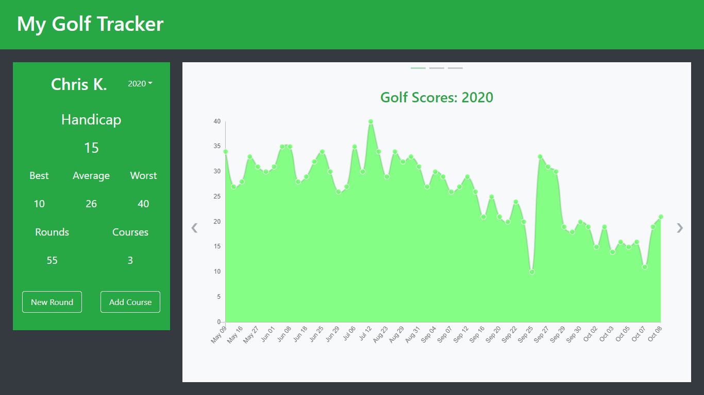
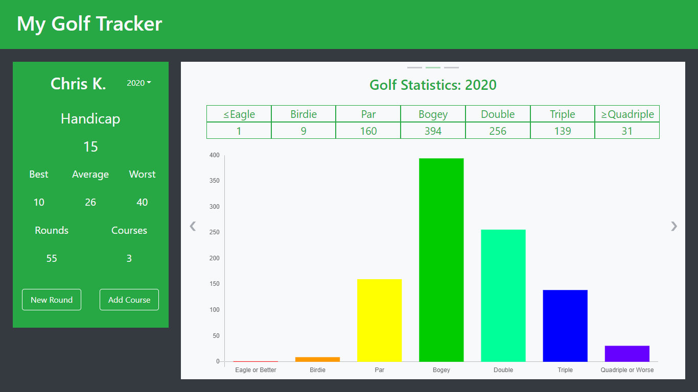
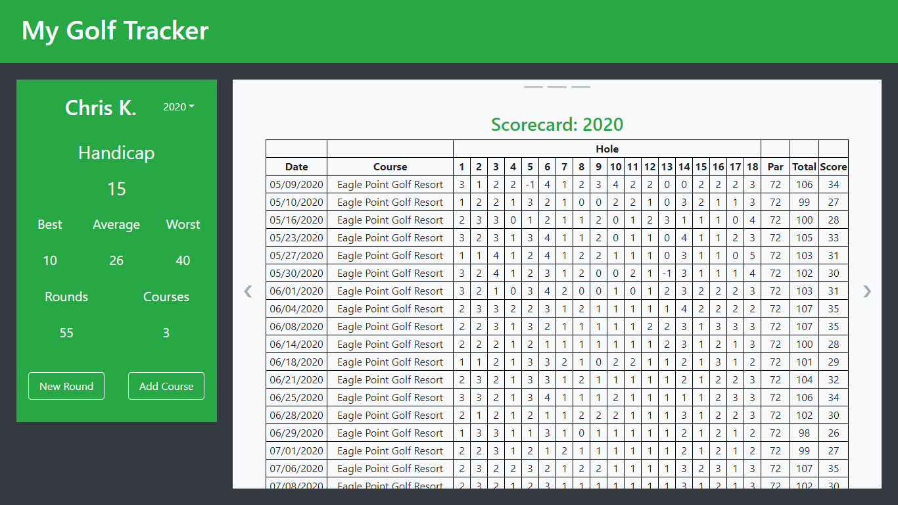
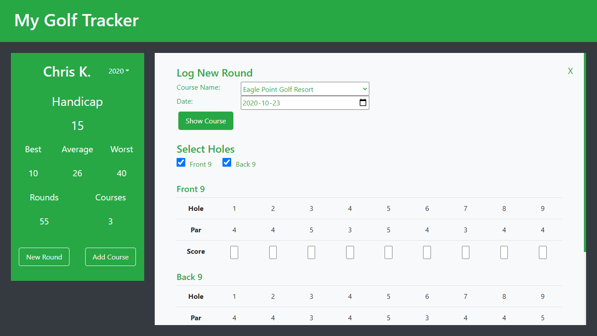
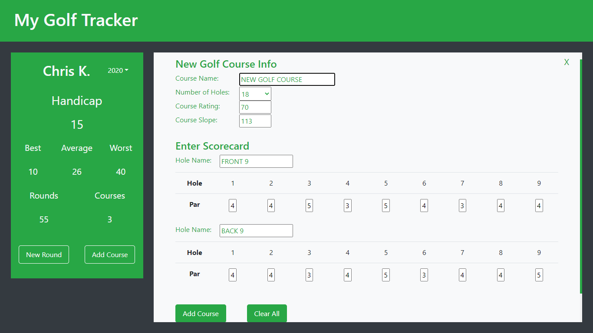

# My Golf Tracker Back-end 

### Summary  

As an avid golfer wanting to improve his game, I developed this application to help visualize and keep track of my progress. 

The back-end application is hosted on Heroku using its free-tier plan. This may cause it to take a few seconds to load as the app is put to sleep after 30 minutes of inactivity.  

The front-end web application is hosted on GitHub using GitHub pages.  
[Website Link](https://ikim1991.github.io/my-golf-tracker/)  
[GitHub Repo](https://github.com/ikim1991/my-golf-tracker/)  

The Back-end was built using Express.js and MongoDB on Node.js.  

The Golf Tracker application lets the user log all their rounds by the season. This data is used to keep track of the user's progress and visualizes the data. It displays a summary of the user's info on the side while the main content of the page uses pagination to navigate through 3 figures created using Chart.js.  

A 16:9 aspect ratio resolution is recommended.  
The app is currently not supported on mobile and tablets.  
Minimum screen resolution width of 1024px required.  

### Images  

  
Single Page Application with pagination. Line chart created using Chart.js (Screenshot from 1366x768 resolution)  

  
Barchart created using Chart.js (Screenshot from 1366x768 resolution)  

  
Single Page Application. Main display page (Screenshot from 1366x768 resolution)  

  
Logging a new round (Screenshot from 1366x768 resolution)  

  
Add a new course to your database (Screenshot from 1366x768 resolution)  

### License  

The MIT License (MIT)  

Copyright 2020 Chris Kim  

Permission is hereby granted, free of charge, to any person obtaining a copy of this software and associated documentation files (the "Software"), to deal in the Software without restriction, including without limitation the rights to use, copy, modify, merge, publish, distribute, sublicense, and/or sell copies of the Software, and to permit persons to whom the Software is furnished to do so, subject to the following conditions:  

The above copyright notice and this permission notice shall be included in all copies or substantial portions of the Software.  

THE SOFTWARE IS PROVIDED "AS IS", WITHOUT WARRANTY OF ANY KIND, EXPRESS OR IMPLIED, INCLUDING BUT NOT LIMITED TO THE WARRANTIES OF MERCHANTABILITY, ITNESS FOR A PARTICULAR PURPOSE AND NONINFRINGEMENT. IN NO EVENT SHALL THE AUTHORS OR COPYRIGHT HOLDERS BE LIABLE FOR ANY CLAIM, DAMAGES OR OTHER LIABILITY, WHETHER IN AN ACTION OF CONTRACT, TORT OR OTHERWISE, ARISING FROM, OUT OF OR IN CONNECTION WITH THE SOFTWARE OR THE USE OR OTHER DEALINGS IN THE SOFTWARE.  
